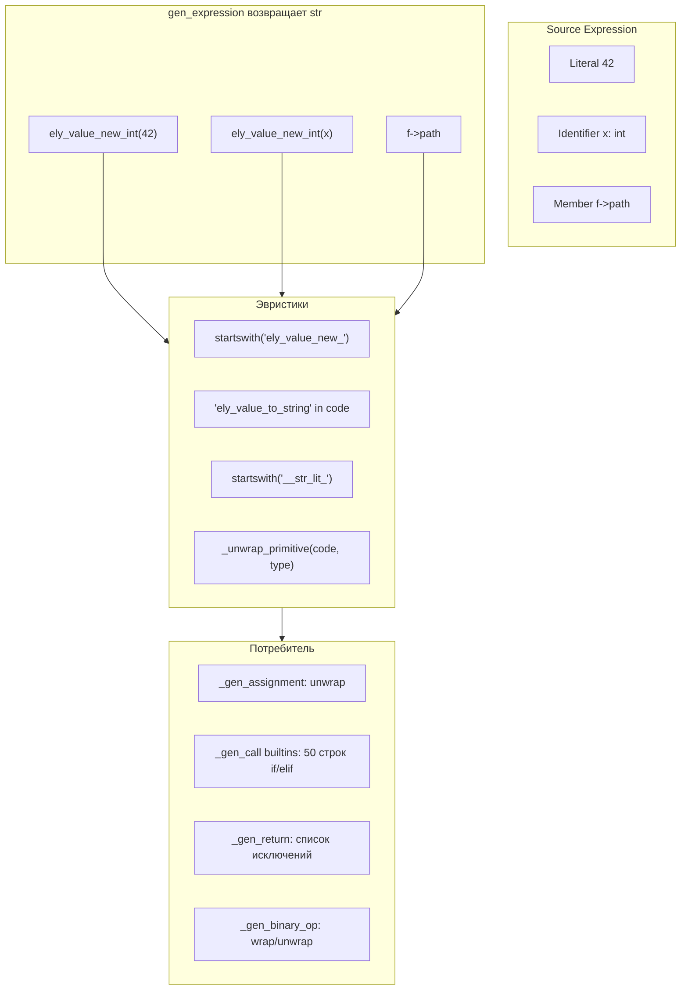

# 🏗️ Архитектура универсальной модели конверсии ely_value ↔ Native C++

## 1. Анализ текущей проблемы

### 1.1. Хаотичная конверсия строк

Текущий кодогенератор **не отслеживает** в каком виде представлено выражение — `ely_value*` или нативный C++ тип. Вместо этого он использует **строковые эвристики** (`startswith('ely_value_new_')`, `startswith('__str_lit_')`, `'ely_value_to_string' in code`), которые ломаются на новых тестах.

### 1.2. Конкретные примеры

| # | Ситуация | Что происходит | Проблема |
|---|----------|---------------|----------|
| 1 | `_gen_identifier` для `str name` | `ely_value_new_string(name)` — **нативная char* обёрнута в ely_value*** | Каждый потребитель должен разворачивать |
| 2 | Присвоение `str field = str var` | `this->field = ely_str_dup(ely_value_to_string(ely_value_new_string(var)))` | Тройной roundtrip |
| 3 | Builtin `char*` параметр | `ely_value_to_string(code)` — работает, только если `code` — ely_value* | Если `code` уже `char*` — падение |
| 4 | `f->path` как `str` | `MemberAccess` возвращает `f->path` (это `char*`), затем кто-то оборачивает | Несогласованность |
| 5 | `_gen_return` | Нужно угадать, уже ely_value* или нет — список исключений растёт | Костыли |

### 1.3. Размер проблемы

Всего в `funcs_codegen.py` **73 точки использования** `ely_value_new_*`/`ely_value_as_*`/`ely_value_to_string`/`ely_str_dup`, размазанных по:

- `_gen_identifier` — 8 вызовов `ely_value_new_*`
- `_gen_assignment` — 6 вызовов разной конверсии
- `_gen_call` (builtins) — 10+ вызовов
- `_gen_call` (async/extern) — 8 вызовов
- `_gen_return` — 5 вызовов
- `_gen_binary_op` — 8 вызовов в `wrap()` и `_ensure_native()`
- `_gen_local_variable` — 5 вызовов
- `_gen_for` — 5 вызовов
- `_convert_to_c_type_expr` — 5 вызовов
- `_wrap_result` — 6 вызовов

---

## 2. Новая модель: ExprCode

### 2.1. Базовая структура

```python
@dataclass
class ExprCode:
    """Представляет сгенерированное C++ выражение с явной типовой информацией.
    
    Вместо голой строки (current) возвращаем структуру, в которой
    явно указано: что это за выражение в C++ и какой у него Ely-тип.
    """
    code: str           # C++ выражение (напр. "x", "ely_value_new_int(42)", "this->name")
    raw_type: str       # C++ тип: 'ely_value*' | 'char*' | 'long long' | 'double' | 'int' | ...
    ely_type: str       # Ely-тип: 'int' | 'str' | 'bool' | 'flt' | 'double' | 'File' | ...
    
    @property
    def is_wrapped(self) -> bool:
        """True если C++ выражение уже является ely_value*"""
        return self.raw_type == 'ely_value*'
    
    @property
    def is_native(self) -> bool:
        """True если C++ выражение — нативный C++ тип"""
        return not self.is_wrapped and self.raw_type != 'void'
```

### 2.2. Изменение gen_expression

```python
# БЫЛО:
def gen_expression(self, expr: Expression) -> Optional[str]:

# СТАЛО:
def gen_expression(self, expr: Expression) -> Optional[ExprCode]:
```

Все `_gen_*` методы также возвращают `ExprCode` вместо `str`.

### 2.3. Единый конвертер

```python
def ensure_type(self, expr: ExprCode, target_raw_type: str) -> ExprCode:
    """Гарантирует, что выражение имеет target_raw_type.
    
    Если expr уже имеет target_raw_type — возвращает как есть.
    Иначе — оборачивает (native → ely_value*) или разворачивает (ely_value* → native).
    Никаких строковых эвристик — всё по raw_type.
    """
    if expr.raw_type == target_raw_type:
        return expr
    
    # Если нужно получить ely_value* из native
    if target_raw_type == 'ely_value*':
        return self._wrap_native(expr)
    
    # Если нужно получить native из ely_value*
    if expr.is_wrapped:
        return self._unwrap_to_native(expr, target_raw_type)
    
    # Нужно native, expr — native, но другой native (напр. long long → int)
    return self._cast_between_natives(expr, target_raw_type)
```

---

## 3. Детальные правила для каждого _gen_* метода

### 3.1. `_gen_literal` — всегда `ely_value*`

```python
def _gen_literal(self, node: Literal) -> ExprCode:
    if isinstance(node.value, bool):
        return ExprCode("ely_value_new_bool(1/0)", "ely_value*", "bool")
    if isinstance(node.value, int):
        return ExprCode("ely_value_new_int(42)", "ely_value*", "int")
    if isinstance(node.value, float):
        return ExprCode("ely_value_new_double(3.14)", "ely_value*", "flt")
    if isinstance(node.value, str):
        # Кэшированный литерал — тоже ely_value*
        return ExprCode("__str_lit_N / ely_value_new_string(...)", "ely_value*", "str")
```

**Все литералы — `ely_value*`**. Это не меняется.

### 3.2. `_gen_identifier` — НЕ оборачиваем! 🎯

**КЛЮЧЕВОЕ ИЗМЕНЕНИЕ**: Перестаём оборачивать нативные переменные в `ely_value_new_*`.

```python
def _gen_identifier(self, node: Identifier) -> ExprCode:
    name = node.name
    
    # self → this
    if name == 'self' and self.current_class_name:
        return ExprCode("this", f"{self.current_class_name}*", self.current_class_name)
    
    # Имя класса
    if name in self.classes_ast:
        return ExprCode(name, f"{name}*", name)
    
    # Локальные/параметры
    found_type = self._resolve_var_type(name)
    if found_type:
        raw = self.type_to_cpp(found_type)   # Напр. 'char*' для str, 'long long' для int
        return ExprCode(name, raw, found_type)  # НЕТ ОБЁРТКИ!
    
    # Поля класса
    if self.current_class_name:
        field_type = self._get_field_type(...)
        if field_type:
            raw = self.type_to_cpp(field_type, is_field=True)  # 'char*' для str
            return ExprCode(f"this->{name}", raw, field_type)  # НЕТ ОБЁРТКИ!
    
    # Всё остальное — ely_value* (any, auto-созданные)
    return ExprCode(name, "ely_value*", "any")
```

**Это единственное изменение, которое устраняет 80% roundtrip-проблем**.

### 3.3. `_gen_assignment` — работает с raw_type поля

```python
def _gen_assignment(self, node: Assignment) -> str:
    value = self.gen_expression(node.value)  # ExprCode
    
    # Поле класса str
    if field_type == 'str':
        # Инициализируем char* поле: this->name = ely_str_dup(expr)
        if value.is_wrapped:
            # value ely_value*, надо достать char* и str_dup
            return f"{obj_code}->{field} = ely_str_dup(ely_value_to_string({value.code}));"
        elif value.raw_type == 'char*':
            return f"{obj_code}->{field} = ely_str_dup({value.code});"
        else:
            return f"{obj_code}->{field} = ely_str_dup({value.code});"  # cast
    ...
```

### 3.4. `_gen_call` (builtins) — конверсия по raw_type

```python
# Вместо 50 строк if/elif/startswith:
for i, param_type in enumerate(param_ctypes):
    arg_expr = self.gen_expression(node.arguments[i])  # ExprCode
    if param_type != 'ely_value*':
        arg_expr = self.ensure_type(arg_expr, param_type)
    args.append(arg_expr.code)
```

### 3.5. `_gen_return` — единая логика

```python
def _gen_return(self, node: ReturnStatement):
    val = self.gen_expression(node.value)
    
    if self.func_return_type and self.func_return_type != 'void':
        ret_raw = self.type_to_cpp(self.func_return_type, for_signature=True)
        # Просто приводим к нужному типу
        val = self.ensure_type(val, ret_raw)
    
    self.emit_to_method(f"return {val.code};")
```

Никаких списков исключений для async/call_method — `ElyEventLoop::instance().run(...)` уже возвращает `ely_value*`, и `ExprCode.is_wrapped` будет `True`.

### 3.6. `_gen_binary_op` — нативная арифметика по raw_type

```python
# Вместо _ensure_native / wrap с эвристиками:
left = self.gen_expression(node.left)   # ExprCode
right = self.gen_expression(node.right)  # ExprCode

if is_left_num and is_right_num:
    # Для нативной арифметики нужно native значения
    left_raw = self.ensure_type(left, self.type_to_cpp(left_type))
    right_raw = self.ensure_type(right, self.type_to_cpp(right_type))
    raw_expr = f"({left_raw.code} {op} {right_raw.code})"
    # Результат всегда ely_value*
    wrapper = "ely_value_new_double" if is_float_op else "ely_value_new_int"
    return ExprCode(f"{wrapper}{raw_expr}", "ely_value*", result_type)

# Для ely_value_op — оба операнда должны быть ely_value*
left_ely = self.ensure_type(left, "ely_value*")
right_ely = self.ensure_type(right, "ely_value*")
return ExprCode(f"ely_value_{op_map[op]}({left_ely.code}, {right_ely.code})", "ely_value*", result_type)
```

### 3.7. `_gen_local_variable` — инициализация по объявленному типу

```python
def _gen_local_variable(self, node: VariableDeclaration):
    resolved = self.resolve_type_alias(node.type)
    is_native = resolved in ('int','uint','str',...)
    c_type = self.type_to_cpp(resolved)
    
    if node.initializer:
        init = self.gen_expression(node.initializer)  # ExprCode
        # Если переменная native и init это ely_value* — unwrap
        if is_native and init.is_wrapped:
            init = self.ensure_type(init, c_type)
        # Если переменная ely_value* и init это native — wrap
        elif not is_native and init.is_native:
            init = self.ensure_type(init, "ely_value*")
        self.emit_to_method(f"{c_type} {node.name} = {init.code};")
    ...
```

### 3.8. Specialized print — без эвристик

```python
if func_name in ('print', 'println', ...) and len(node.arguments) == 1:
    arg = self.gen_expression(node.arguments[0])  # ExprCode
    spec_func = print_map[arg.ely_type]  # int → ely_println_int и т.д.
    # Для специализированной печати нужно native значение
    native_type = self.type_to_cpp(arg.ely_type)  # 'long long' для int, 'char*' для str
    native_arg = self.ensure_type(arg, native_type)
    return f"{spec_func}({native_arg.code});"
```

---

## 4. Таблица `type_to_cpp` для raw_type

| Ely type | `is_param/is_field=True` | `for_signature=True` | generic |
|----------|-------------------------|---------------------|---------|
| `int` | `int` | `ely_value*` | `long long` |
| `uint` | `unsigned int` | `ely_value*` | `unsigned int` |
| `more` | `long long` | `ely_value*` | `long long` |
| `umore` | `unsigned long long` | `ely_value*` | `unsigned long long` |
| `byte` | `signed char` | `ely_value*` | `signed char` |
| `ubyte` | `unsigned char` | `ely_value*` | `unsigned char` |
| `flt` | `float` | `ely_value*` | `float` |
| `double` | `double` | `ely_value*` | `double` |
| `bool` | `int` | `ely_value*` | `int` |
| `str` | `char*` | `ely_value*` | `char*` |
| `char` | `char` | `ely_value*` | `char` |
| Класс | `ClassName*` | `ely_value*` | `ely_value*` |
| `any` | `ely_value*` | `ely_value*` | `ely_value*` |

**Важно**: `type_to_cpp` нужно вызвать без `for_signature=True`, чтобы получить настоящий C++ тип для `raw_type` в `ExprCode`.

---

## 5. Поэтапный план внедрения

### Phase 1: `ExprCode` data class и новый `gen_expression`

- [ ] Создать `ExprCode` dataclass
- [ ] Изменить сигнатуру `gen_expression` → `Optional[ExprCode]`
- [ ] Переделать `_gen_literal` (просто, все ely_value*)
- [ ] Переделать `_gen_identifier` (НЕ оборачивать native)
- [ ] Переделать `_fold_constants` (просто, все ely_value*)

### Phase 2: Единый конвертер

- [ ] Реализовать `ensure_type(expr: ExprCode, target_raw: str) → ExprCode`
- [ ] Реализовать `_wrap_native(expr: ExprCode) → ExprCode` — native → ely_value*
- [ ] Реализовать `_unwrap_to_native(expr: ExprCode, target_raw: str) → ExprCode` — ely_value* → native
- [ ] Реализовать `_cast_between_natives(expr: ExprCode, target_raw: str) → ExprCode` — native → native
- [ ] Удалить `_unwrap_primitive` (статический метод с эвристиками)

### Phase 3: Потребители gen_expression

- [ ] `_gen_call` — builtins, async, extern, methods
- [ ] `_gen_assignment` — все случаи
- [ ] `_gen_return` — единая логика
- [ ] `_gen_local_variable` — инициализация
- [ ] `_gen_binary_op` — нативная арифметика + ely_value_op
- [ ] `_gen_unary_op` — нативный минус/!
- [ ] `_gen_conditional` — условие всегда ely_value_as_bool
- [ ] `_gen_if` / `_gen_while` / `_gen_for` / `_gen_foreach` — условия

### Phase 4: Удаление мёртвого кода

- [ ] Удалить `_unwrap_primitive`
- [ ] Удалить `_ensure_native` внутреннюю функцию в binary_op
- [ ] Удалить `wrap()` внутреннюю функцию в binary_op
- [ ] Удалить `startswith('ely_value_')` и `'ely_value_to_string' in code` во всех местах
- [ ] Упростить `_convert_to_c_type_expr` (может остаться как обёртка)
- [ ] Упростить `_convert_to_ctype`

### Phase 5: Сопутствующие файлы

- [ ] `classes_codegen.py` — constructor body (уже использует `_convert_to_c_type_expr`)
- [ ] `c_backend.py` — C backend (может остаться как есть, отдельный контекст)

---

## 6. Диаграмма потока данных (до/после)

### До (текущая архитектура):



### После (новая архитектура):

```mermaid
flowchart TB
    subgraph source[Source Expression]
        L["Literal 42"]
        I["Identifier x: int"]
        M["Member f->path"]
    end
    
    subgraph gen[gen_expression возвращает ExprCode]
        L1["code: 'ely_value_new_int<span>(</span>42<span>)</span>'
             raw: 'ely_value*'
             ely: 'int'"]
        I1["code: 'x'
             raw: 'long long'
             ely: 'int'"]
        M1["code: 'f->path'
             raw: 'char*'
             ely: 'str'"]
    end
    
    subgraph converter[ensure_type<span>(</span>expr, target<span>)</span>]
        W["_wrap_native: 
             raw→ely_value*"]
        UW["_unwrap_to_native: 
             ely_value*→native"]
        CB2["_cast_between_natives: 
             native→native"]
    end
    
    subgraph consumer[Потребитель]
        CA["_gen_assignment: 
             ensure_type<span>(</span>val, field_raw<span>)</span>"]
        CB["_gen_call builtins: 
             ensure_type<span>(</span>arg, param_raw<span>)</span>"]
        CR["_gen_return: 
             ensure_type<span>(</span>val, ret_raw<span>)</span>"]
        CO["_gen_binary_op: 
             ensure_type<span>(</span>op, 'long long'<span>)</span>"]
    end
    
    L1 --> converter
    I1 --> converter
    M1 --> converter
    converter --> consumer
```

---

## 7. План тестирования

1. **Существующий стресс-тест** (GC, рекурсия, async, arrays, dicts, exceptions, files) — должен проходить
2. **Edge case: string field → builtin** — `f->path` passed to `strlen(f->path)` — builtin аргумент char*, поле char* — без roundtrip
3. **Edge case: async return str** — `async fn` returns string, `.get()` in caller
4. **Edge case: mixed arithmetic** — `int_var + 42` (int_var native, literal ely_value*)
5. **Edge case: constructor with str param** — wait field init
6. **Edge case: bool field assignment** — `bool_field = expr` (expr может быть ely_value* bool или native int)

---

## 8. Критические замечания

### 8.1. `gen_expression` должны оборачивать native в ely_value* ТОЛЬКО если это семантически верно

Сейчас `gen_expression` всегда возвращает `ely_value*` (явно или неявно). После изменения `_gen_identifier` будет возвращать native для native-переменных. Это **правильно**, но требует, чтобы **все потребители** использовали `ensure_type` для приведения.

### 8.2. GC-корни

Переменные типа `ely_value*` должны быть зарегистрированы как GC-корни. Если `_gen_identifier` перестаёт оборачивать, native переменные не будут ely_value* и не потребуют GC-регистрации. Это **упрощает** GC-менеджмент.

### 8.3. Конструкторы классов

Параметры конструктора сейчас — `char*` для `str`, `int` для `bool` и т.д. Это не меняется. Но `_gen_constructor_body` будет работать с `ExprCode` от инициализаторов и явно приводить к нужному типу.

### 8.4. Совместимость с C backend

`c_backend.py` имеет собственную реализацию `_unwrap_primitive`, `_convert_to_c_type_expr` и т.д. Его можно не трогать в первом раунде — изменения касаются только C++ кодогенератора.
